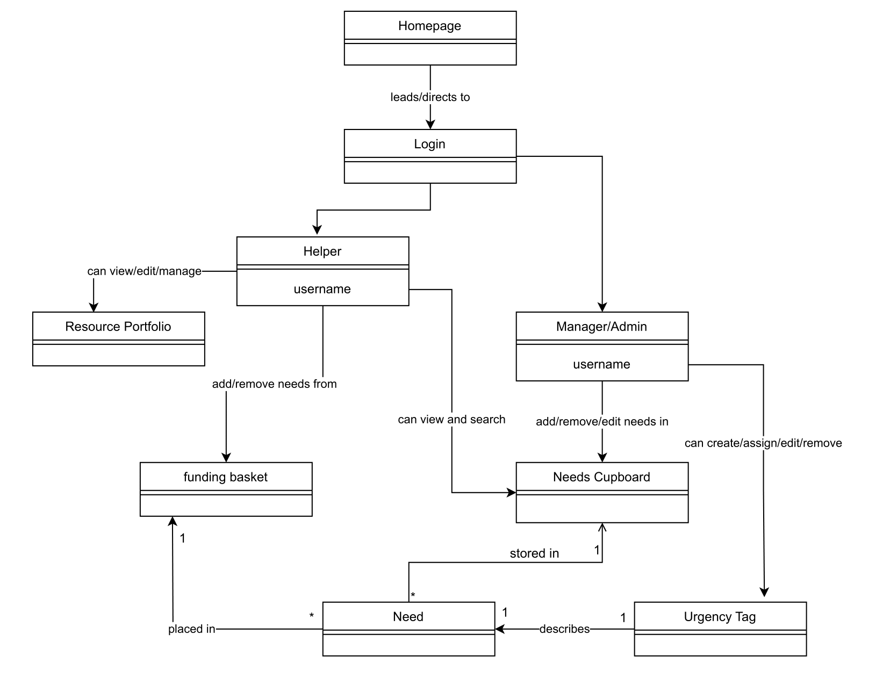
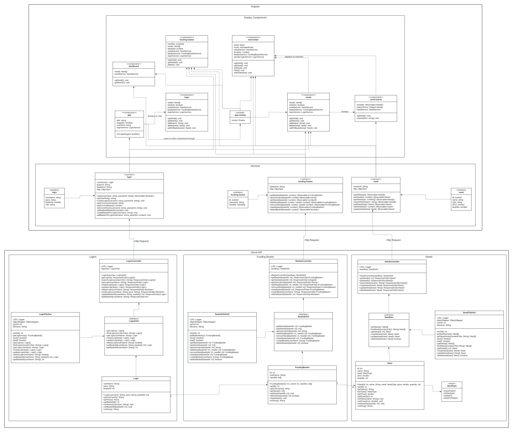
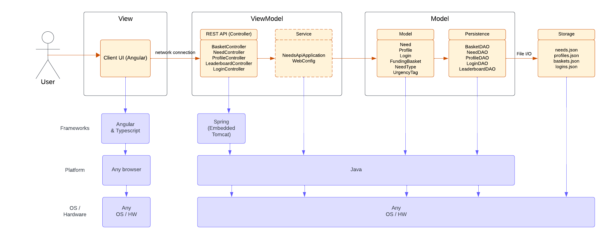
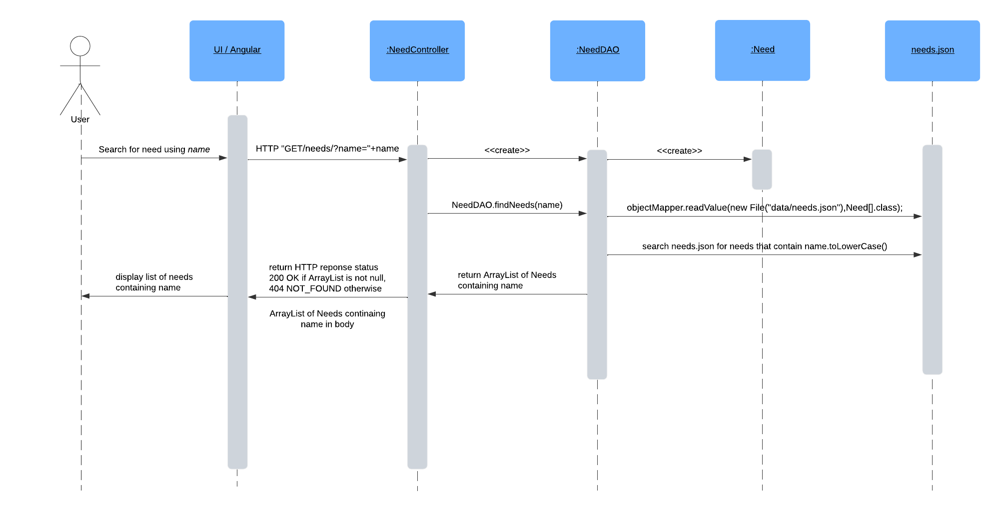
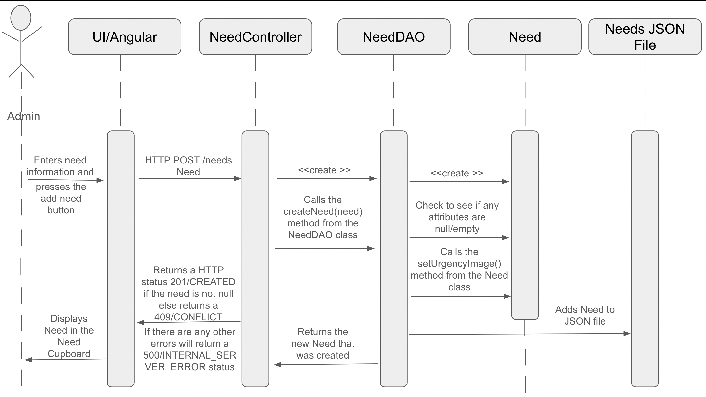
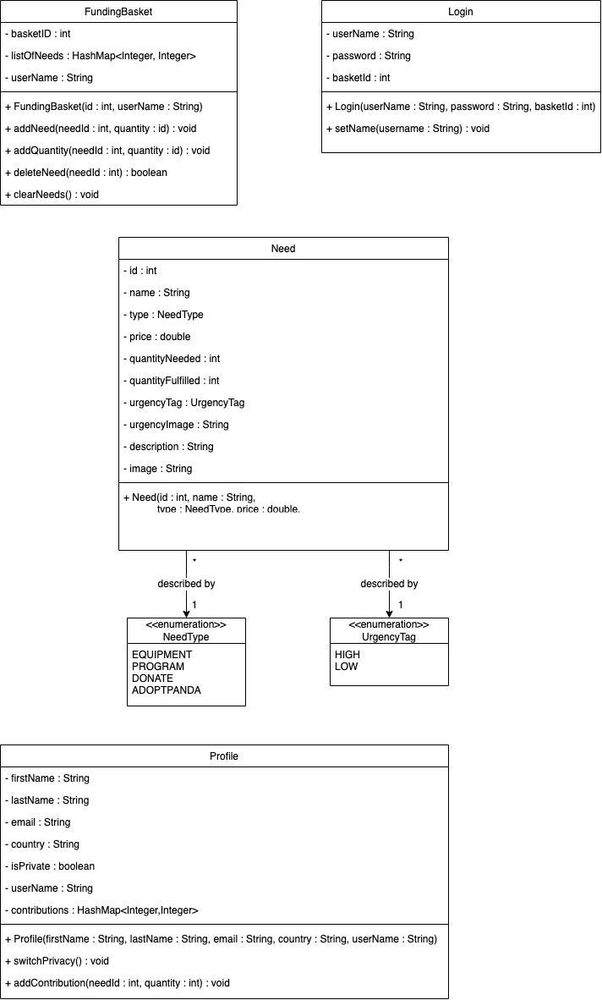
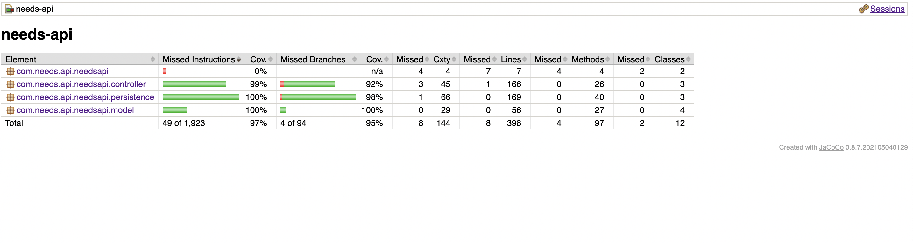
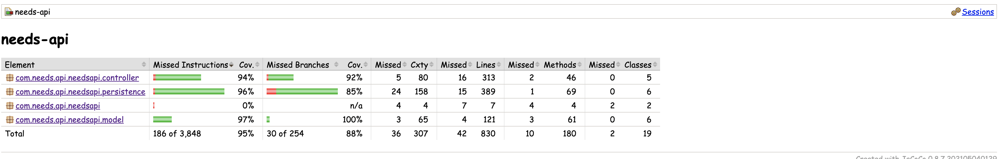

# Swiss Pandas Design Documentation

## Team Information
* Team name: Swiss Pandas
* Team members
  * Jack Sutton
  * Oscar Li
  * Veronika Kirievskaya
  * Ryan Garvin
  * Zoe Rizzo

## Executive Summary

This is a summary of the project.

### Purpose
**Sprint 2** -
  The purpose of the project is to build a wbesite for a non profit Pandas International. It will host needs in a cupboard, in which each need is a representation of something that the nonprofit needs. Helpers can make accounts so they can view and select said needs and put those needs in their funding basket. Admins can make accounts to view the needs cupboard and update, add, or delete needs.

  For this sprint we implemented login authentification and funding basket, while also adding a user interface using angular 

**Sprint 4** -
  The project aims to build a funding platform for the non profit Pandas International, a panda conservation group. There are two types of users, the admin and the helper. The admin is able to login using the reserved credentials to manage the organization's needs and view the progress of each need. The helper is able to make an account, after which they can fund needs.

  By this sprint, a helper is able to check out the needs in their funding basket, which adds to the helper's contributions list and adds to the amount funded for the need. A helper can now also manage their profile and account after logging in.

### Glossary and Acronyms
> _**[Sprint 2 & 4]** Provide a table of terms and acronyms._

| Term | Definition |
|------|------------|
| SPA | Single Page |
| MVP | Minimum Viable Product |
| API | Application programming interface |
| JSON | JavaScript Object Notation |
| cURL | Client URL |
| DRY | Dont Repeat Yourself |
| DAO | Data Access Object - used to pass data from a place of storage to files that use the data and back |
| Need | An item, goal, or action that the non-profit requires |
| Cupboard | The list of all needs |
| Funding Basket | An individual Helper's shopping cart |
| Admin | Manager of the U-Fund website. Admins can edit the Cupboard |
| Helper | Users of the U-Fund website. Helpers can purchase Needs |
| U-Fund | The website |
| Definition of Done | A list of tasks that must be completed in order to consider a piece of code fully complete |
| User Story | A sentence identifying the target audience, goal, and benefit of a piece of code |

## Requirements

This section describes the features of the application.

### Definition of MVP
**Sprint 2** - 
  The website should be full functional supporting user and admin accounts. In which the users have a funding basket and can see the needs in the cupboard but can not edit them. The user can serach for a need and once a need is added to the funnding basket the user should be able to do all curl commands pertaining to the funding basket and be able to purchese a need. The admin should be able to edit the cupbaord but have no accesss to the users funding basket.

**Sprint 4** - 
  At this stage, both helpers and admins are be able to login with a username and password. A helper can see a list of needs (the needs cupboard), can search for a need, can add/remove an item to their funding basket, and can proceed to check out and commit to all the items in their funding basket. An admin can add, remove or delete needs in the cupboard.

  In addition, the following enhancements have been implemented: a helper has a profile page, where they can manage their profile and account credentials; an admin is able to set the urgency of a need as either high or low; high urgency needs are displayed first in search results.

### MVP Features
Top-level Epics and Stories of the MVP include:
+ Epic: Check Out Page - As a helper I want to access a check out page so that I can fund the needs that are in my basket.
+ Epic: Profile Page - As a Helper I want to view profile page so that I can see funding basket, contributions, and contact info.
+ Epic: Funding Basket - As a helper I want to view and edit my funding basket so that I can make donations to my needs of choice.
+ Epic: Need Cupboard - As an admin I want to manage my needs cupboard so that I can accurately communicate what my organization needs.
+ Epic: Login/Authentication - As an admin I want to log in to the website so that I can manage my organization's needs. As a helper, I want to log in to the website so that I can fund an organization's needs.
+ Epic: Need Search - As a helper I want to search for organizations' needs so that I can find needs to add to my funding basket and checkout.
+ Story: Images with Needs - As an admin I want to an image to be associated with each need so that needs are easier to identify.
+ Story: Needs Description - As a helper I want to see a description of each need so that I can better understand what I am contributing to. As an admin I want to see a give each need a description so that I can explain what my organization needs.
+ Story: Create Urgency Tags - As an admin I want to associate each need with an urgency of high or low so that helpers know which needs to prioritize.
+ Story: Progress Bar - As a user I want to be able to easily see the progress of a need (how much of the quantity is fulfilled) so that I can quickly tell if a need has been fulfilled.

### Enhancements
The following are enhancements that we have implemented for the project:
+ Profile Page - Every helper has a profile page, where they can manage their profile (this includes personal information such as first and last name) and account credentials (username and password). The helper can also make their account private or public and view a list of their contributions.
+ Leaderboard - Both admin and helpers can view a community leaderboard, which ranks each helper by the amount they have contributed (the dollar amount of needs that they have checked out/funded). If a helper's account is public, their username and fullname are displayed on the leaderboard. If a helper sets their profile to private, then their name and username are displayed as anonymous on the leaderboard.
+ Need Progress Bars - Each need has a progress bar that displays how much of the needed quantity has been fulfilled. When a helper funds some amount of that need, the progress bar is updated.
+ Urgency Tags - An admin is able to set the urgency of a need as either high or low. High urgency needs are displayed first in search results, and have an urgency icon next to their name when displayed in the needs cupboard.

### Assumptions

**For Sprint 2 Release:**
1. The quantity of a need is the amount that a user will be purchasing, not the total amount of a need that is available in the needs cupboard. 
1. The price of a need is the price of the entire quantity, not individual price.

**For Sprint 4 Release:**
1. Surplus is not allowed to be funded for any needs.

## Application Domain

This section describes the application domain.

> _**[Sprint 2 & 4]** Provide a high-level overview of the domain for this application. You
> can discuss the more important domain entities and their relationship
> to each other._

## Architecture and Design

This section describes the application architecture.

### Summary

The following Tiers/Layers model shows a high-level view of the webapp's architecture. 
**NOTE**: detailed diagrams are required in later sections of this document. (_When requested, replace this diagram with your **own** rendition and representations of sample classes of your system_.) 

The web application, is built using the Model–View–ViewModel (MVVM) architecture pattern. 

The Model stores the application data objects including any functionality to provide persistance. 

The View is the client-side SPA built with Angular utilizing HTML, CSS and TypeScript. The ViewModel provides RESTful APIs to the client (View) as well as any logic required to manipulate the data objects from the Model.

Both the ViewModel and Model are built using Java and Spring Framework. Details of the components within these tiers are supplied below.

### Overview of User Interface

This section describes the web interface flow; this is how the user views and interacts with the web application.
### Sprint 1 
Currently (after the completion of sprint 1), the user is able to enter commands from the command line to create, update, delete, search for, or get needs.   
The end goal for our web application is to greet users with a home page where they will have the option to log in. Once an admin logs in, they will be able to view their organization's needs cupboard. That page will provide them with options to manage their organization's needs. Once a helper logs in, they will be able to view their funding basket, as well as the organization's needs cupboard. After selecting needs from their funding basket, the helper would also be able to see a checkout page where they can actually fund their chosen needs. As one of our 10% enhancements, we also plan to provide the helper with a resource portfolio page, which would show them their funding history and possibly funding suggestions.

### Sprint 2 
Currently (after the completion of Sprint 2), a user can make an account and login in with that username and password. Helpers can then see a collection of needs in the need cupboard, in which they can search and select the need they want to add it to their funding basket. Admins do not have access to the funding baskets but can make changes to the need cupboard by adding new needs, updating existing needs, or deleting needs from the cupboard.

The end goals for us is to look to add enhancement features to the project.

### Sprint 3
The user has the same base funcionality as in Sprint 2. Now, however, the admin can also assign a default image and an urgency tag to each need. The urgency of a need is either low or high. If the urgency of a need is high, an exclamation mark symbol is displayed by its name across the website. In addition, when searching for needs, the high urgency needs are displayed first. Each helper now also has access to a profile page, where they can enter their first and last name, update their login information, or view their contributions. Each helper's contributions is a list of each need the helper has funded, along with the quanity they funded. Both helpers and admins can also view the community leaderboard, which is a ranking of helpers by the amount they have contributed. The leaderboard displays each user's username, full name, and total amount contributed in dollars. However, if a user sets their account to private on their profile page, then the leaderboard displays "Anonymous" instead of the user's username and full name.

### View Tier
**Overview:** This tier is made up of many components, each of which manages the display for a piece of the website and uses one or more services to communicate with the other tiers.

**Helper Perspective:** 
When a new helper opens our website, they are greeted by a login/goal page where they are able to create a login - this page is displayed by the login component, which uses the login service to make a new Login, Profile, and FundingBasket for the user. 
After logging in with their new credentials - the login component uses the login service to verify the username and password entered - the helper is taken to the dashboard - this is displayed by the dashboard component, which uses the need service to get the top high urgency needs and the progress for each of those needs.
Then, the helper navigates to thee organization's needs cupboard - this is displayed by the needs component, which uses the need service to get all needs and the login service to tell if the user is logged in as a helper or admin. 
While in the cupboard, the helper can search for a specific need - this is displayed by the need search component, which uses the need service to search for needs and return matching results. A list of matching needs is displayed, and the helper clicks on one. The helper is taken to a page displaying all of the need's information - this is displayed by the need detail component, which uses the need service to get the correct need and the login service to tell if the user is logged in as a helper or admin (so that the right fields are displayed). The helper then decides to fund this need, and clicks the button to add this need to their funding basket - the need detail component uses the basket service to add that need to the helper's basket. Then, the helper follows the same steps to add a second need to their basket.
Then, the helper navigates to their funding basket - this is displayed by the funding basket component, which uses the funding basket service to get all needs in the helper's basket. The helper decides to add more of the first need to their basket and remove the second need from their basket all together - the funding basket component uses the funding basket service to add and remove needs from basket. 
The helper then proceeds to check out - the funding basket component uses the needService to fulfill quantity for each need, the profile service to add contributions to the helper's profile, and the funding basket service to clear the basket. 
Then, the helper navigates to their profile page - this is displayed by the profiles component (which uses the login service to get current username and the profile service to get the user's profile) and the contributions component (which uses the profile service to get the helper's past contributions). The helper then decides to update their first and last name so that they can be identified on the leaderboard - the profiles component uses the profile service to update the profile. The helper also decides to update their username - the profiles component uses the login service to update the login, the profile service to update the profile, and the basket service to set new username. 
Afterwards, the helper navigates to the leaderboard view - this is displayed by the leaderboard comopnent, which uses the leaderboard service to get the leaderboard that is displayed. The helper decides they don't want their full name to be shown, so they navigate to their profile page and switch their account to private - the profiles component uses the profile service to switch the privacy of the helper's profile.

**Admin Perspective:** 
When an admin opens our website, they are greeted by a login/goal page. They are able to login using the reserved credentials and navigate to the needs cupboard.  Inside the cupboard, the admin can add a new need or delete an existing one. This is displayed by the needs component, which uses the login service to tell if the user is logged in as an admin and the need service to add or delete a need. The admin can also navigate to the details page for a need and update the information of the need. This is displayed by the need detail component, which uses the login service to tell if the user is logged in as a helper or admin (so that the right fields are displayed) and the need service to update the need.

Searching for a need by name Sequence Diagram

creating a new need  Sequence Diagram

> _**[Sprint 4]** To adequately show your system, you will need to present the **class diagrams** where relevant in your design. Some additional tips:_
 >* _Class diagrams only apply to the **ViewModel** and **Model** Tier_
>* _A single class diagram of the entire system will not be effective. You may start with one, but will be need to break it down into smaller sections to account for requirements of each of the Tier static models below._
 >* _Correct labeling of relationships with proper notation for the relationship type, multiplicities, and navigation information will be important._
 >* _Include other details such as attributes and method signatures that you think are needed to support the level of detail in your discussion._

### ViewModel Tier
**Overview:** This tier is made up of many controller classes, each of which handles http requests for a certain object (FundingBasket, Leaderboard, Login, Need, and Profile) using the persistence classes.

**Helper Perspective:** 
When a new helper opens our website, they are greeted by a login/goal page. There, they are able to create a login - this calls the LoginController (which creates a new Login object using the credentials), the ProfileController (which creates a new Profile object using the passed-in credentials), and the BasketController (which creates a Basket object for the user). 
After logging in with their new credentials - this calls the LoginController (which verifies a login given a username and password) - the helper is taken to the organization's needs cupboard - this calls the NeedController (which returns all of the needs and gets the current progress of every need in the cupboard). 
While in the cupboard, the helper can search for a specific need - this calls the NeedController (which returns all needs whose name contains the searched-for text). A list of matching needs is displayed, and the helper clicks on one. The helper is taken to a page displaying all of the need's information - this calls the NeedController (which returns a Need object matching the given id). The helper then decides to fund this need, and clicks the button to add this need to their funding basket - this calls the BasketController (which adds the specified quantity of the Need object to the user's FundingBasket basket). Then, the helper follows the same steps to add a second need to their basket. Then, the helper navigates to their funding basket - this calls the BasketController (which gets the basket corresponding to a given user id, gets all needs inside that basket, and gets the quantity of each need in the basket). The helper decides to add more of the first need to their basket and remove the second need from their basket all together - this calls the BasketController (which sets the quantity of a given need in a given funding basket and deletes a Need object from a FundingBasket). 
The helper then proceeds to check out - this calls the BasketController (which clears the FundingBasket), the ProfileController (which adds the contribution to the helper's profile), and the NeedController (which fulfills a certain amount of quantity for a given need). 
Then, the helper navigates to their profile page - this calls the ProfileController (which returns the Profile object corresponding to the given username). The helper then decides to update their first and last name so that they can be identified on the leaderboard - this calls the ProfileController (which updates the Profile with the provided information). The helper also decides to update their username - this calls the LoginController (which updates the Login object related to the helper's username and updates the Login's related basketId). 
Afterwards, the helper navigates to the leaderboard view - this calls the LeaderboardController (which returns the full leaderboard). The helper decides they don't want their full name to be shown, so they navigate to their profile page and switch their account to private - this calls the ProfileController (which switches a Profile to be private or public).

**Admin Perspective:** 
When an admin opens our website, they are greeted by a login/goal page. They are able to login using the reserved credentials and navigate to the needs cupboard.  Inside the cupboard, the admin can add a new need or delete an existing one. The admin can also navigate to the details page for a need and update the information of the need. All of these actions call the NeedController (which creates a Need object with the provided information, updates the Need object with the new information, and deletes a Need with the given id).

> _At appropriate places as part of this narrative provide **one** or more updated and **properly labeled**
> static models (UML class diagrams) with some details such as critical attributes and methods._
> 

### Model Tier
> _**[Sprint 2, 3 & 4]** Provide a summary of this tier of your architecture. This
> section will follow the same instructions that are given for the View
> Tier above._

**Sprint 2**
* NeedType.java 
  * This file stores an enum class called NeedType that stores the categories for the diffrent needs. They can either be equipment, program, donation, or the adopt a panda program. 

* Need.java
  * This file stores the blueprint for a need. A need is made up of a id number, name, need type, price, and quantity and can preform the curl fuctions on any one of these pramaters except id number you can not update that once assigned. 

* Login.java
  * This file stores the blueprint for the login feature. Login is made up of a username and password. Login can get and update the username but can only get the password.

* FundingBasket.java
  * This file stores the blueprint for the funding basket feature. funding basket is made up of an id number and username. The funding basket has meathods to support geting all needs, clearing all needs, adding a need, removing a need, and geting the username and id of the basket.

**Sprint 3** - The following classes have been updated or added to this tier since the previous sprint:
* Need.java
  * This file contains the blueprint for a need. A need is made up of a id number, name, need type, price, quantity needed, quantity fulfilled, urgency tag (with possible urgency image), description, and image. All of these attributes, except id number, have getters and setters to access them. 

* Login.java
  * This file contains the blueprint for the login feature. A login's attributes are a username, password, and basket id. Getters are available for all attributes, but setters are only available for the username and basket id.

* FundingBasket.java
  * This file contains the blueprint for the funding basket feature. A funding basket's attributes include an id number, a list of numbers, and a username. The funding basket has methods to support getting all attributes, clearing all needs from the basket, adding a need to the basket, and updating the amount of a need in the basket.

* Profile.java
  * This file contains the blueprint for the profile feature. Its tied to a login through the user's unique userName. This object stores personal information that the user chooses to give, such as email, country, as well as the users previous contributions which it handles through its addContribtion function.
  * A profile's attributes include a first name, last name, email, country, username, and a list of contributions. The profile also tracks whether it has been set to private. The profile has methods to support getting all attributes and setting the first name, last name, email, and country. There are also methods to switch the privacy on or off and add an amount of a need to the contributions list.

* UrgencyTag.java 
  * This file contains an enum class called UrgencyTag that stores the diffrent urgencies for a need. They can either be High or Low, and each urgency is assosciated with a string filename representing an image of a symbol (blank for low urgency and an exclamation mark for high urgency). These icons are used to quickly show if a need has high urgency.

**Sprint 4** -
  This tier has two main goals: (1) it contains classes representing each of the objects in action during the application, and (2) it contains the persistence files necessary to store every need in the organization and every user's login, profile, and basket. 

_Helper Perspective:_ 
When a new helper opens our website, they are greeted by a login/goal page. There, they are able to create a login - this calls the LoginDAO and Login class (the DAO creates a new Login instance using the credentials and saves it), the ProfileDAO and Profile class (the DAO creates a new Profile object using the passed-in credentials and saves it), and the BasketDAO and FundingBasket class (the DAO creates a Basket object for the user and saves it). 
After logging in with their new credentials - this calls the LoginDAO and Login class (the DAO verifies that a login with the given username and password has already been created) - the helper is taken to the organization's needs cupboard - this calls the NeedDAO, Need class, and NeedType enum (the DAO returns all of the need objects and gets the current progress of every need in the cupboard). 
While in the cupboard, the helper can search for a specific need - this calls the NeedDAO, Need class, and NeedType enum (the DAO returns all need objects whose name contains the searched-for text). A list of matching needs is displayed, and the helper clicks on one. The helper is taken to a page displaying all of the need's information - this calls the NeedDAO, Need class, and NeedType enum (the DAO returns a Need object matching the given id). The helper then decides to fund this need, and clicks the button to add this need to their funding basket - this calls the BasketDAO, FundingBasket class, and Need class (the DAO updates the user's Funding Basket with the specified quantity of the Need object). Then, the helper follows the same steps to add a second need to their basket. Then, the helper navigates to their funding basket - this calls BasketDAO and FundingBasket class (the DAO gets the basket corresponding to the user's id, then uses the FundingBasket class to get all needs inside that basket and the quantity of each need in the basket). The helper decides to add more of the first need to their basket and remove the second need from their basket all together - this calls the BasketDAO and FundingBasket class (the DAO updates the user's FundingBasket instance with the new quantity of the need and deletes a Need object from a FundingBasket). 
The helper then proceeds to check out - this calls the BasketDAO and FundingBasket class (the DAO clears all Needs from the FundingBasket), the ProfileDAO and Profile class (the DAO adds the contribution to the helper's profile), and the NeedDAO and Need class (the DAO updates the quantity fulfilled for that instance of Need). 
Then, the helper navigates to their profile page - this calls the ProfileDAO and Profile class (the DAO returns the Profile instance matching the user's username). The helper then decides to update their first and last name so that they can be identified on the leaderboard - this calls the ProfileDAO and Profile class (the DAO updates updates the Profile instance with the provided information). The helper also decides to update their username - this calls the LoginDAO and Login class (the DAO updates the Login instance with the new username). 
Afterwards, the helper navigates to the leaderboard view - this calls the LeaderboardDAO (the DAO uses instances of Profile and Need to return a full leaderboard). The helper decides they don't want their full name to be shown, so they navigate to their profile page and switch their account to private - this calls the ProfileDAO and Profile class (the DAO updates the Profile instance's isPrivate to true).

_Admin Perspective:_  
When an admin opens our website, they are greeted by a login/goal page. They are able to login using the reserved credentials and navigate to the needs cupboard.  Inside the cupboard, the admin can add a new need or delete an existing one. The admin can also navigate to the details page for a need and update the information of the need. All of these actions call the NeedDAO and Need class (the DAO creates an instance of Need with the provided information, updates the Need instance with the new information, and deletes a Need instance with the given id).

> _At appropriate places as part of this narrative provide **one** or more updated and **properly labeled**
> static models (UML class diagrams) with some details such as critical attributes and methods._

## OO Design Principles
### Sprint 1
**Single Responsibility** - 
In sprint 1 we created the Need class along with the NeedType class
the Need class has a FileDAO for persistence and a Controller class for interacting with the FileDAO.
We were able to uphold the Single Responsibility principal quite well. Stating that a class should only hold one responsibility and only have one *reason* to change, we can see that this applies to every class created in our application so far.
When looking at the Need class, we find that its constructor is only called when createNeed is run from the NeedFileDAO. Similarly, its only the FileDAO that is able to update properties of and delete a need. On top of this, the Need class itself is self contained and only responsible for storing information related to a need.
The NeedFileDAO, likewise, is only called and used when called through the NeedController. It is only responsible for interpreting requests from the Controller into Needs that are saved into a file.
Finally, the NeedController gets requests from REST and sends them to the NeedFileDAO, acting as nothing but a link between REST requests and the persistence layer.
Along with this, we have a NeedType class that details types of Needs in an enum, something kept out of the Need class itself to help keep with this principal.

**Dependency Inversion** - 
A good example of separating concerns NeedController and the NeedFileDAO are independent of each other and since the NeedFileDAO is injected into the NeedController you can swap it out for other modules such as the NeedMongoDAO. In our team we use dependency injection by making  our NeedsDAO interface and injecting it into the NeedsFileDAO class.
Dependency inversion is the principle that states, High-level modules should not depend on low-level modules. Both should depend on abstractions.A common manifestation of this is just called dependency injection, which is where a high-level module injects the low level module. Really what dependency inversion is trying to do is separate concerns and lower the amount of coupling. It makes sure that a class only has to deal with one problem and then another class will deal with another problem and they both work individually of each other, then when you do a dependency interjection, you take the lower level module and inject an instance of that lower level module into the higher level module. This way you can swap out that lower level module for another module or a dummy module for testing purposes.
In our case whe have the NeedFileDAO file that is a low level module and it relies on the high level interface NeedDAO.

### Sprint 2
**Law of Demeter** -
The law of Demeter is all about objects avoiding accessing the internal data and methods of other objects. We practice this alot in this sprint. For instance with our Funding basket class and our needs class know nothing about each other even though they are related in the real world. The needs object the would have been used in the fnding basket class is the need_id so we dont need to use the actual nee object we can just use its id. This way it lowers coupling and contruibutes to Single Responsibility. This is also the case for the controllers too.

**Controller** -
Having a controller class helps practice Single Responsibility. The purpose of the controller is to make API requests and provide responses using HTTP Protocols. It is not concerned with the management of the data or even the underlying storage mechanism. It would be possible to implement everything without a controller class but his would be very limiting. All of our data points and and feature classes have a Controller associated with them. For example the Funding basket class is responsible for geting all needs, clearing all needs, adding a need, removing a need, and geting the username and id of the basket. Then Basket controller however is responsible for making API requests and provide responses using HTTP Protocols with those meathods. This divides the responsibility so you dont just have one big class thast hard to read and test. We also do this with our login and needs classes.

### Sprint 3
**Information Expert** -
In Angular there are many "pieces" that fit together to make a puzzle. These inculde the service.ts, components.ts, and the type script for the components. With so many pieces interconnected it can get confusing if there was no clear purpose for each component. By following the OO design of information expert, each component would have a clearly defined role. By following this principle you create software with high cohesion and increase in encapsulation. An example of this would be our Login component. The login component have functions that only have a single responsibility, it would check user authentication, if a user was login or not, the results of a login. Our Login service would exclusivly set user role for the login user. Now that we know Login Service sets roles, and Login Component can update login, check login result and much more, we can simply import it in our Profile component which is one of our enhancements for sprint 3. In the Profile component a user is able to change their login. To do this we need to authenticate the user and check what role they have, since both Login Service and Components have the functionality to do these task, we can use the Object Oriented Design Principle of Information Expert to get the necessary data.

### Sprint 4

> _**[Sprint 2, 3 & 4]** Will eventually address upto **4 key OO Principles** in your final design. Follow guidance in augmenting those completed in previous Sprints as indicated to you by instructor. Be sure to include any diagrams (or clearly refer to ones elsewhere in your Tier sections above) to support your claims._

> _**[Sprint 3 & 4]** OO Design Principles should span across **all tiers.**_

## Static Code Analysis/Future Design Improvements
> _**[Sprint 4]** With the results from the Static Code Analysis exercise, 
> **Identify 3-4** areas within your code that have been flagged by the Static Code 
> Analysis Tool (SonarQube) and provide your analysis and recommendations.  
> Include any relevant screenshot(s) with each area._

> _**[Sprint 4]** Discuss **future** refactoring and other design improvements your team would explore if the team had additional time._

## Testing
> _This section will provide information about the testing performed
> and the results of the testing._

### Acceptance Testing
> _**[Sprint 2 & 4]** Report on the number of user stories that have passed all their
> acceptance criteria tests, the number that have some acceptance
> criteria tests failing, and the number of user stories that
> have not had any testing yet. Highlight the issues found during
> acceptance testing and if there are any concerns._

  **Sprint 2**
  All of our user stories for sprint 2 have passed their tests(8 users stories)
   

  **Sprint 4**
  All user stories passed all of ttheir acceptance criteria tests. Issues found during testing (both individual anad cross team) that were resolved are: two needs of same name can be added; basket price does not update upon checkout; editing profile information (changing login) does not persist.

### Unit Testing and Code Coverage
  **Sprint 2**
   

  There is zero code coverage for the root needs api folder. This is because there are no unit tests written for the two files used to run our backend. These two files only contain the logic to run the application, not any written functionality that can be tested.

  **Sprint 4**
   

  Our unit testing strategy was to write unit tests for a file during or immediately after development of the code inside. By doing this, we ensured that the code functionned correctly before passing it on to be reviewed by another team member to ensure completeness. To comply with this strategy, the task "unit tests written" was part of the definition of done for every user story.

  We selected our coverage target to be 90% because this allowed for a high level of coverage while not creating too much addititonal work for our team to complete, as we were highly constrained by time in all sprints.

  Our code coverage met our targets (overall we had 95% coverage), especially the persistence and model files. Our controller files, while still meeting the target, had the lowest percentage of code coverage because two classes required last minute changes to meet product owner expectations.
